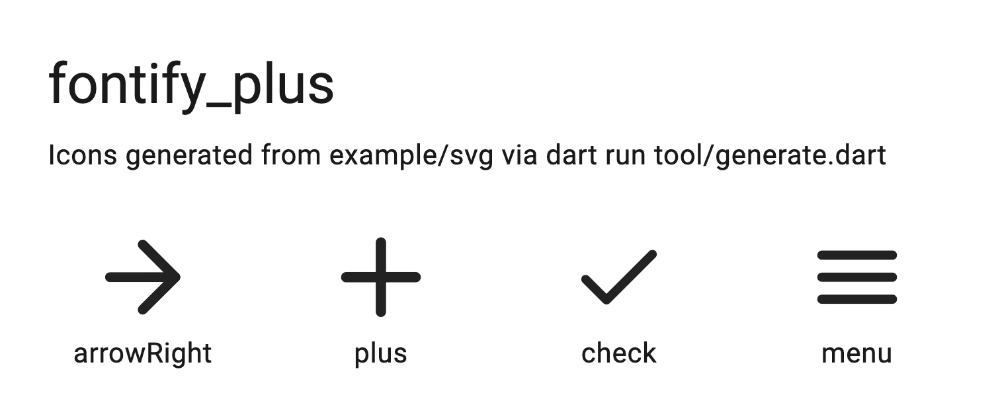

# fontify_plus

[](https://pub.dartlang.org/packages/fontify_plus)

The fontify_plus package provides an easy way to convert SVG icons to OpenType font
and generate Flutter-compatible class that contains identifiers for the icons
(just like [CupertinoIcons][] or [Icons][] classes).



Pure Dart CLI/API (pub dependencies only; no native toolchains).
Compatible with dart2js and dart2native.

Outline-style icon sets — the kind Figma, Hugeicons, Lucide and Feather export —
are drawn with strokes rather than fills. Font glyphs are fill-only, so
fontify_plus converts each stroke into the region it covers before encoding it.
That happens by default; see [Stroked icons](#stroked-icons).

[CupertinoIcons]: https://api.flutter.dev/flutter/cupertino/CupertinoIcons-class.html
[Icons]: https://api.flutter.dev/flutter/material/Icons-class.html

See [Getting started](doc/getting_started.md) for a walkthrough from install to
a working Flutter icon font.

## Using CLI tool

[Globally activate][] the package, then run `fontify_plus` on a directory of SVGs.
Flags and YAML config are covered in [doc/cli.md](doc/cli.md). Flutter
`fonts:` registration is in [doc/getting_started.md](doc/getting_started.md).

[globally activate]: https://dart.dev/tools/pub/cmd/pub-global

```sh
dart pub global activate fontify_plus
fontify_plus assets/svg/ fonts/my_icons_font.otf --output-class-file=lib/my_icons.dart --indent=4 -r
fontify_plus --font=icons --watch
```

## Using API

[svgToOtf][] and [generateFlutterClass][] build the font and Flutter class from
Dart. [runFontJob][] runs the same directory-based pipeline as the CLI. See
[doc/api.md](doc/api.md) and the [example folder][].

[example folder]: https://github.com/4akloon/fontify_plus/tree/master/example
[svgToOtf]: https://pub.dev/documentation/fontify_plus/latest/fontify_plus/svgToOtf.html
[generateFlutterClass]: https://pub.dev/documentation/fontify_plus/latest/fontify_plus/generateFlutterClass.html
[runFontJob]: https://pub.dev/documentation/fontify_plus/latest/fontify_plus/runFontJob.html

## Stroked icons

Outline-style SVGs describe stroke centrelines, not filled regions — naive
conversion leaves them invisible. fontify_plus outlines strokes by default
(`stroke-width`, caps, joins, dashes). Pass `--no-outline-strokes` to treat path
data as fill geometry. Details, limitations, and troubleshooting:
[doc/stroked_icons.md](doc/stroked_icons.md).

## Glyph sizing

By default each glyph is scaled so its longest side fills the em square
(`--normalize`, on). Pass `--no-normalize` to map each viewBox onto the em
and keep relative artboard sizes. See [doc/glyph_sizing.md](doc/glyph_sizing.md).

## Notes

- Generated OpenType font is using CFF table.
- Generated font is using PostScript Table (post) of version 3.0, i.e., it doesn't contain glyph names.
- Supported SVG elements: path, g, circle, ellipse, rect, polyline, polygon,
line, use, defs, symbol.
- SVG transforms are applied to paths according to specs.
- SVG `<g>` element's children are expanded to the root with transformations applied.
`<use>` referencing a `<defs>` or `<symbol>` element is supported and expands the
same way.
- Consider using [Non-zero fill rule][].
- Shapes (circle, rect, etc.) are always converted to paths.
- Paint attributes other than stroke geometry — `fill` colour, gradients,
opacity — are ignored. A glyph is a single-colour region; colour comes from the
surrounding text style at render time.
- With `--no-normalize`, icons should share a viewBox; mismatched heights log
a warning. See [doc/glyph_sizing.md](doc/glyph_sizing.md).
- When Flutter class is generated, static variable names derive from the SVG
file name converted to lowerCamelCase (Dart's convention for constants) with
non-allowed characters removed.
Name is set to 'unnamed', if it's empty.
A numeric suffix is added if the name already exists (`name2`, `name3`, …).

[Non-zero fill rule]: https://developer.mozilla.org/en-US/docs/Web/SVG/Attribute/fill-rule

## Contributing

Any suggestions, issues, pull requests are welcomed. See
[CONTRIBUTING.md](CONTRIBUTING.md) for how to get set up and what a change is
expected to look like.

## License

[MIT](https://github.com/4akloon/fontify_plus/blob/master/LICENSE)
